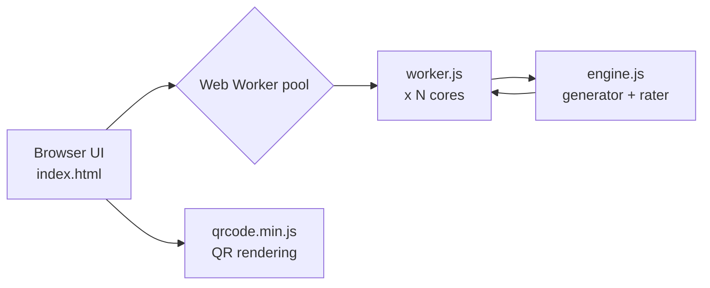

# SudokuGen

A fast, offline, dependency-free Sudoku puzzle generator for printing paper puzzle sheets. Generate as many puzzles as you need at a chosen difficulty, print them, and reveal each solution by scanning the QR code on your phone — no server, no account, no network required.

**Live site:** <https://quangtle.github.io/SudokuGen/>

---

## Features

- **Four difficulty levels** — Easy, Medium, Hard, Expert — graded by *human-solving technique*, not clue count
- **Flexible layouts** — 1/2/4/6 games per page, 1–5 pages (up to 30 puzzles per batch)
- **Print-ready output** — print CSS hides the UI and paginates one sheet per page
- **Scan-to-reveal solutions** — each puzzle carries a QR code that opens a page showing the solution
- **Self-contained** — the solution is encoded *in the URL itself*; nothing is stored server-side
- **Fast** — parallel generation across Web Workers keeps even Expert batches near-instant
- **Works offline** — all assets are local files; no CDNs or build step

---

## How it works

### Architecture



| File | Purpose |
|---|---|
| `index.html` | UI, controls, rendering, print CSS, worker-pool orchestration, solution-view mode |
| `engine.js` | The Sudoku engine: solver, difficulty rater, generator, and solution codec |
| `worker.js` | Web Worker entry point that generates a chunk of puzzles in parallel |
| `qrcode.min.js` | Local copy of [`qrcode-generator`](https://github.com/kazuhikoarase/qrcode-generator) (no CDN) |
| `.github/workflows/deploy.yml` | Auto-deploys `main` to GitHub Pages |

### Difficulty grading (technique-based)

Difficulty is determined by running a **human-style logical solver** that applies techniques in increasing order of power. The puzzle is rated by the hardest technique required to solve it:

| Tier | Level | Techniques |
|---|---|---|
| 1 | Easy | Naked singles, hidden singles |
| 2 | Medium | Locked candidates (pointing / claiming) |
| 3 | Hard | Naked & hidden pairs |
| 4 | Expert | Naked & hidden triples |
| 5 | *(internal)* | X-Wing |

A rating of `0` means the puzzle can't be finished with these techniques alone (it needs guessing), so it's rejected. During generation, the digger removes clues only while the puzzle **stays uniquely solvable AND remains within the target tier** — difficulty is a property of the solving path, not a clue-count target.

### Solution encoding

Only valid solution grids are encoded, exploiting the structural fact that **every row is a permutation of 1–9**:

1. Each row is ranked with its **Lehmer code** (a rank in `0..9!-1`)
2. The 9 ranks are packed into one big integer: $N = \sum_{r=0}^{8} \text{rank}_r \cdot (9!)^r$ (≈ 167 bits)
3. $N$ is rendered in **base64url** → a code of at most **28 characters**

The code is embedded in the URL fragment:

```
https://quangtle.github.io/SudokuGen/#s=<encoded solution>
```

Opening that URL displays the full solution grid — the page decodes the hash and renders it. Nothing is stored anywhere; the URL itself carries all the data.

---

## Usage

1. Open the page (live site, or locally — see below)
2. Pick **Difficulty**, **Games per page**, and **Pages**
3. Click **Generate**
4. Click **Print** to print the sheets (controls are excluded automatically)

To reveal a solution:

- **Scan the QR code** under a puzzle with any phone camera, or
- Manually open the puzzle's URL (`...#s=<code>`) in a browser

---

## Running locally

No build step or `npm install` — it's plain HTML + JS.

Because generation uses Web Workers, serve the folder over HTTP rather than opening `index.html` via `file://` (browsers block Workers on `file://`). The page automatically falls back to synchronous generation if Workers are unavailable.

```bash
# Any static server works, e.g.
npx serve .
# or
python -m http.server 8080
# or
npx http-server .
```

Then open <http://localhost:8080>.

---

## Deployment

The repository ships a GitHub Actions workflow (`.github/workflows/deploy.yml`) that builds and deploys the site to **GitHub Pages** on every push to `main`. No manual setup is required beyond enabling Pages.

To deploy your own fork:

1. Push to your `main` branch
2. In your repo: **Settings → Pages → Source: GitHub Actions**
3. The workflow deploys automatically; your site appears at `https://<user>.github.io/<repo>/`

---

## Performance

- Generation is distributed across a Web Worker pool sized to `navigator.hardwareConcurrency` (max 8)
- The difficulty rater uses an early-exit cap so digging stops rating as soon as a puzzle exceeds the target tier
- Approximate single-threaded times per puzzle: Easy ~18 ms, Medium ~36 ms, Hard ~49 ms, Expert ~70 ms
- A 5-page Expert batch (20 puzzles) completes in roughly **0.2–0.3 s** wall-clock on a multi-core machine

---

## License

No license specified. `qrcode.min.js` is the MIT-licensed [`qrcode-generator`](https://github.com/kazuhikoarase/qrcode-generator) library by Kazuhiko Arase.